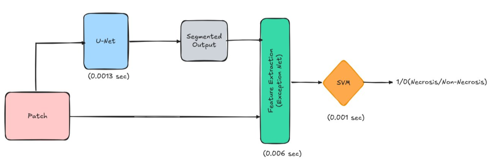
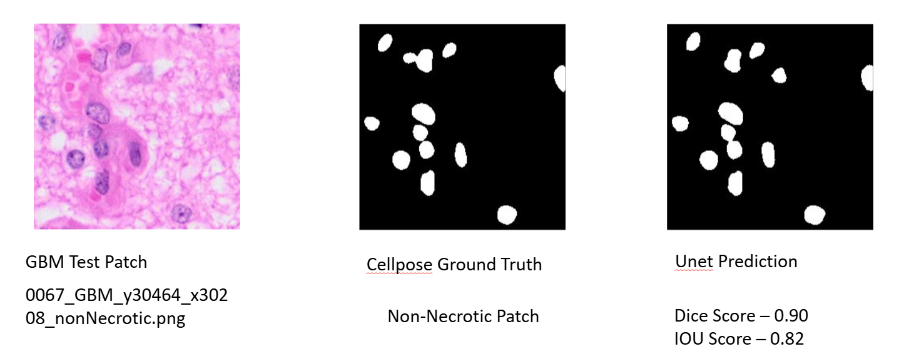
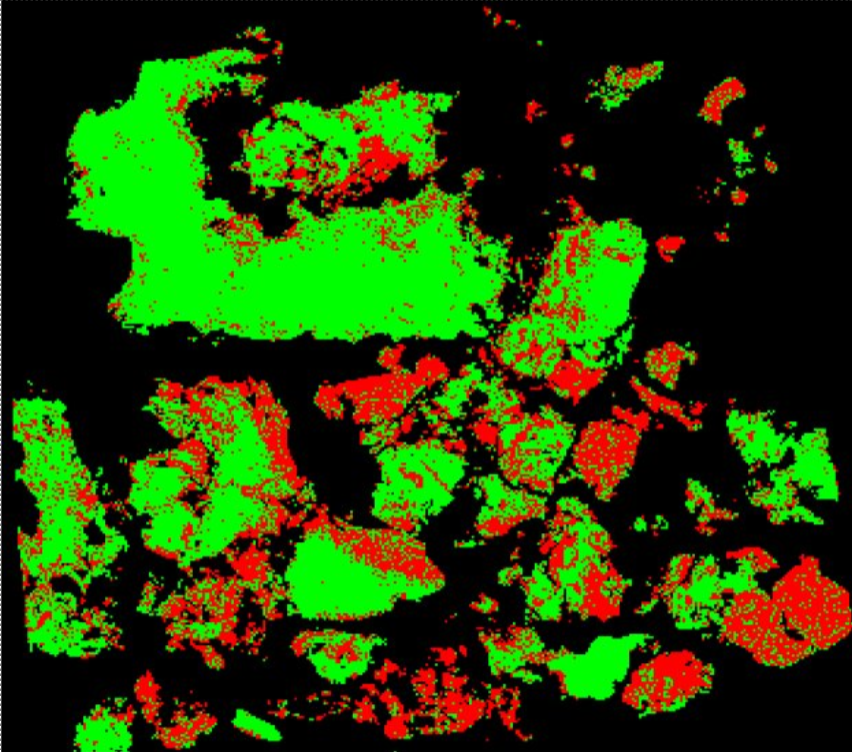

# NecroScan

> **Fast, end-to-end necrosis detection in histopathology whole-slide
> images (WSIs)**

NecroScan is an AI pipeline for detecting necrotic regions in
**glioblastoma (GBM)** and **meningioma (MNG)** histopathology images.
The system combines automated WSI patch extraction, Cellpose-based
ground-truth generation, deep-learning segmentation, feature extraction,
and SVM-based classification to produce patch-level predictions and
slide-level necrosis visualizations.

The project was designed around a key objective: **reduce the
computational cost of whole-slide necrosis analysis while maintaining
strong segmentation and classification performance.**

------------------------------------------------------------------------

## ✨ Highlights

-   Processed **50,000+ histopathology patches** extracted from WSIs.
-   Standardized WSI processing into **256 × 256 RGB patches**.
-   Generated patch labels from **GeoJSON necrosis annotations** using
    tissue and polygon-overlap thresholds.
-   Used **Cellpose** to generate cell-level segmentation masks for
    ground truth.
-   Fine-tuned multiple segmentation models:
    -   U-Net
    -   Swin U-Net
-   Used **Xception** for feature extraction from both the original
    image and segmentation mask.
-   Concatenated two **2048-dimensional** feature vectors into a
    **4096-dimensional representation** for SVM classification.
-   Trained SVM models for **necrosis vs. non-necrosis** classification.
-   Evaluated models across GBM, MNG, and mixed-domain settings.
-   Built a WSI inference pipeline producing slide-level necrosis
    heatmaps.
-   Reported whole-slide processing improvement from approximately **45
    minutes to 12 minutes (\~73% reduction)**.

------------------------------------------------------------------------

## 🧠 Problem

Histopathology whole-slide images are extremely large and cannot be
processed efficiently as a single image. Necrosis detection therefore
requires the WSI to be divided into smaller patches, analyzed
individually, and then reconstructed into a slide-level result.

The original baseline approach used for comparison was computationally
expensive and time-consuming. NecroScan explores a faster pipeline while
retaining the important segmentation and classification stages.

The project focuses on two tissue types:

-   **Glioblastoma (GBM)**
-   **Meningioma (MNG)**

------------------------------------------------------------------------

## 🏗️ Pipeline

The complete pipeline can be summarized as:

``` text
                    Whole Slide Image (WSI)
                              │
                              ▼
                    WSI Patch Extraction
                       256 × 256 patches
                              │
                              ▼
                 Tissue / Annotation Processing
                              │
                              ▼
                   Cellpose Ground Truth
                              │
                              ▼
                    ┌──────────────────┐
                    │  Segmentation    │
                    │  U-Net / SwinUNet│
                    └──────────────────┘
                              │
                              ▼
                    Binary Segmentation Mask
                              │
                 ┌────────────┴────────────┐
                 ▼                         ▼
          Original Patch             Segmentation Mask
                 │                         │
                 └────────────┬────────────┘
                              ▼
                     Xception Feature
                        Extraction
                              │
                   2048 + 2048 features
                              │
                              ▼
                     4096-D Feature Vector
                              │
                              ▼
                           PCA
                              │
                              ▼
                           SVM
                              │
                              ▼
                  Necrosis / Non-Necrosis
                              │
                              ▼
                    WSI-Level Heatmap
```

## 🔄 Pipeline



------------------------------------------------------------------------

## 📂 Data Preparation

### WSI patch extraction

Whole-slide images were divided into fixed-size **256 × 256** patches.
Patch filenames retained spatial coordinates so that predictions could
later be mapped back to their original WSI locations.

Example naming pattern:

``` text
ParentWSI_ParentLabel_y_x_Label.png
ParentWSI_ParentLabel_y_x_Mask.png
```

Labels included:

-   `necrosis`
-   `non-necrosis`
-   `admixed`

The parent tissue label identified whether the source was:

-   `GBM`
-   `Meningioma`

------------------------------------------------------------------------

## 🏷️ Automated Patch Labeling

Necrosis annotations were provided as polygons in **GeoJSON** format.

For every patch:

1.  Check the amount of tissue present.
2.  Discard patches with less than **50% tissue**.
3.  Compute overlap between the patch and annotated necrosis polygons.
4.  Assign the patch label using the overlap percentage:
    -   `< 5%` → Normal / non-necrosis
    -   `> 30%` → Necrosis
    -   `5–30%` → Ambiguous
5.  Remove background and ambiguous patches from the final training set.

This produced a cleaner binary dataset for model training.

------------------------------------------------------------------------

## 🔬 Ground-Truth Generation with Cellpose

Cellpose was used to automatically generate cell segmentation masks that
served as ground truth for the segmentation stage.

Example:

``` text
Histopathology Patch
        │
        ▼
     Cellpose
        │
        ▼
Binary Cell Mask
```

## 🔬 Segmentation Results


------------------------------------------------------------------------

# 🧩 Segmentation Models

## U-Net

The baseline segmentation model used a pretrained U-Net with:

-   **Encoder:** ResNet-34
-   **Encoder weights:** ImageNet
-   **Input:** 3-channel RGB patch
-   **Output:** Binary segmentation mask

Three major fine-tuned U-Net variants were developed:

``` text
U-Net (GBM)
U-Net (MNG)
U-Net (GBM + MNG)
```

The project evaluated both within-domain and cross-domain inference.

### GBM U-Net

GBM U-Net achieved:

  Dataset           Mean Dice   Mean IoU
  --------------- ----------- ----------
  GBM test set         0.8165     0.7456
  MNG inference        0.2671     0.1869

The results show a substantial drop when the GBM-specific model was
applied to MNG data.

### MNG U-Net

MNG U-Net achieved:

  Dataset           Mean Dice   Mean IoU
  --------------- ----------- ----------
  MNG test set         0.8586     0.7722
  GBM inference        0.7371     0.6470

This model showed strong performance on MNG and comparatively good
cross-domain performance on GBM.

### Combined GBM + MNG U-Net

Training on both domains produced:

  Dataset                Mean Dice   Mean IoU
  -------------------- ----------- ----------
  GBM + MNG test set        0.8081     0.7979

The combined model showed stable performance and improved generalization
across tissue domains.

------------------------------------------------------------------------

## 🪟 Swin U-Net

Swin U-Net was investigated as an alternative to the convolution-based
U-Net.

Its shifted-window self-attention mechanism provides broader contextual
modeling while maintaining manageable computational cost.

### Configuration

  Parameter                   Value
  --------------- -----------------
  Epochs                        100
  Window size                     4
  Batch size                     16
  Patience                       15
  Learning rate                1e-4
  Loss              Dice + IoU loss

The best checkpoint was obtained at **epoch 98**.

### GBM Test Performance

  Model              Mean Dice     Mean IoU
  --------------- ------------ ------------
  Vanilla U-Net         0.8165   **0.7456**
  Swin U-Net        **0.8286**       0.7107

Swin U-Net produced a higher Dice score, while the vanilla U-Net
achieved the higher IoU score on this GBM test set.


------------------------------------------------------------------------

# 🧬 Feature Extraction

After segmentation, both the original image and its corresponding binary
segmentation mask were passed through **Xception**.

Each input produced a:

``` text
2048-dimensional feature vector
```

The two vectors were concatenated:

``` text
Original image features       → 2048
Segmentation-mask features    → 2048
                                  ─────
Combined representation       → 4096
```

This 4096-dimensional representation was used as input to the SVM
classifier.

> Note: the presentation refers to the feature-extraction stage as
> XceptionNet; some slide text contains a typo such as "Exception Net."

------------------------------------------------------------------------

# 🤖 SVM Classification

The final classification stage uses an SVM to distinguish:

``` text
0 → Non-necrosis
1 → Necrosis
```

### MNG Classification

Dataset:

``` text
Shape: 6848 × 4096
PCA: 4096 → 945
Training samples: 5069
Testing samples: 1779
```

Reported performance:

  Class            Precision   Recall     F1
  -------------- ----------- -------- ------
  Non-necrosis          0.99     0.99   0.99
  Necrosis              0.99     0.99   0.99

### GBM Classification

Dataset:

``` text
Shape: 22480 × 4096
PCA: 4096 → 1223
Train/Test: 80/20
Testing samples: 4496
```

Reported performance:

  Class            Precision   Recall     F1
  -------------- ----------- -------- ------
  Non-necrosis          0.95     0.96   0.96
  Necrosis              0.96     0.95   0.96

------------------------------------------------------------------------

# ⚡ Whole-Slide Inference

The pipeline was benchmarked on complete WSIs to measure practical
inference cost.

A representative full pipeline using the Swin U-Net configuration
processed:

``` text
59,052 patches
```

with the following timings:

  Stage                                   Time
  ----------------------------- --------------
  Patch extraction                    295.05 s
  Binary mask generation               68.55 s
  Xception feature extraction          45.83 s
  SVM classification                   23.95 s
  **Total**                       **433.98 s**

This corresponds to approximately **7.2 minutes** for that specific WSI
pipeline run.

Another full WSI run using the MNG-finetuned U-Net analyzed **44,876
patches** and completed in approximately **12 minutes**.

The broader project benchmark reported an improvement from approximately
**45 minutes to 12 minutes**, corresponding to roughly a **73% reduction
in whole-slide processing time**.

------------------------------------------------------------------------

## 🗺️ WSI-Level Visualization

The final classification results can be stitched back into WSI
coordinates to produce a slide-level heatmap.

The presentation uses:

-   **Green → Non-necrosis**
-   **Red → Necrosis**

## 🗺️ WSI-Level Necrosis Detection



------------------------------------------------------------------------

# 📊 Results Summary

  Component                  Result
  -------------------------- ---------------------------
  Patch size                 256 × 256
  Patch dataset              50,000+ patches initially
  GBM U-Net test Dice        0.8165
  GBM U-Net test IoU         0.7456
  MNG U-Net test Dice        0.8586
  MNG U-Net test IoU         0.7722
  GBM+MNG U-Net Dice         0.8081
  GBM+MNG U-Net IoU          0.7979
  Swin U-Net GBM Dice        0.8286
  Swin U-Net GBM IoU         0.7107
  MNG SVM F1                 0.99
  GBM SVM F1                 0.96
  Reported WSI speedup       \~73%
  Reported processing time   \~45 min → \~12 min

------------------------------------------------------------------------

# 🔎 Key Observations

### 1. Domain-specific training matters

The GBM-finetuned U-Net performed poorly when directly transferred to
MNG data, while the MNG-finetuned model generalized comparatively well
to GBM.

### 2. Combined training improves robustness

The GBM+MNG model produced more stable cross-domain segmentation
performance, suggesting that mixed-domain training can improve
generalization.

### 3. Swin U-Net improves Dice but not IoU in the tested GBM setting

On the reported GBM test set, Swin U-Net achieved a higher Dice score
than vanilla U-Net, while vanilla U-Net retained the higher IoU.

### 4. Classification performance was strong

The Xception + PCA + SVM pipeline achieved high precision, recall, and
F1 on the reported MNG and GBM classification test sets.

### 5. WSI processing is dominated by patch extraction

In the representative full-pipeline runs, patch extraction was the
largest time-consuming stage, making it an important target for further
optimization.


------------------------------------------------------------------------

# 🛠️ Tech Stack

-   **Python**
-   **PyTorch**
-   **U-Net**
-   **Swin U-Net**
-   **Xception**
-   **SVM**
-   **Cellpose**
-   **OpenCV**
-   **PCA**
-   **GeoJSON**
-   **Whole Slide Imaging (WSI)**

------------------------------------------------------------------------

# 📈 Evaluation

### Segmentation

Primary metrics:

-   Dice Score
-   Intersection over Union (IoU)

Evaluation was performed at patch level and, where available, across WSI
inference results.

### Classification

Reported metrics include:

-   Accuracy
-   Precision
-   Recall
-   F1 Score
-   Confusion Matrix
-   ROC / AUC

------------------------------------------------------------------------

# 💻 Hardware

The project presentation reports testing on:

``` text
GPU: NVIDIA RTX A6000
VRAM: ~49 GB
CUDA: 13.0
```

------------------------------------------------------------------------

# 🚀 Future Extensions

The original project objectives included extending the end-to-end
framework beyond necrosis detection toward other pathology biomarkers,
with **mitosis** identified as an initial candidate.

Potential extensions include:

-   Additional biomarkers
-   Improved WSI patch extraction
-   More efficient inference
-   Better cross-domain generalization
-   Additional lightweight segmentation architectures
-   Slide-level quantitative pathology analysis
-   An interactive demonstration tool

------------------------------------------------------------------------

## 📚 Project Documentation

The methodology, experiments, model comparisons, WSI benchmarks, and
segmentation visualizations are documented in the project presentation.
